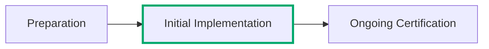

:lucide-person-standing:{ .person title="This content was written by a human just for this page." } :lucide-book-open-check:{ .stable title="This content is relatively stable and only minor changes are expected." }

??? info inline end "Page Info"

    **Description:** An overview of the type of stuff you'll need to do to prepare, and why it's important to officially begin the preparation phase, along with ensuring they understand the scope of FedRAMP.
    
    **Purpose:** Folks will understand that preparing is a big deal and they should make it official and work through it, but also not waste their time if they're in the CMMC game or something.

# The Initial Implementation Phase

The initial implementation work can really begin once you're working with an advisor and have identified a target FedRAMP Certification Profile. You'll
probably want to start by announcing to the world that you're advancing towards a FedRAMP Certification and getting listed in the FedRAMP Marketplace
will be the first test of navigating FedRAMP rules in practice. Then you'll do the necessary work, following FedRAMP Rules, to implement the necessary
changes in your information security program, partner with a FedRAMP Recognized Independent Assessment Service to help you verify and validate your
work, then apply for your target FedRAMP Certification.

The time it takes to complete the Initial Implementation phase and apply for FedRAMP Certification varies wildly depending on a number of factor, including:

- Availability of engineering resources to support Governance, Risk, and Compliance (GRC) engineering functions
- Complexity of the underlying infrastructure and information systems
- Maturity of the existing engineering and information security programs
- Reliance on third-party infrastructure or platform services that aren't FedRAMP Certified
- Executive support, especially within engineering and security functions

!!! warning "FedRAMP Certification should not be treated as a compliance exercise!"

    Establishing a separate compliance organization that does not have access to the same
    engineering resources that are building and operating the cloud service offering is a
    guaranteed way to make obtaining and maintaining FedRAMP Certification far harder and
    less efficient than it should be.

    FedRAMP Certification **will** require some processes to be changed, it is not simply
    writing about everything that already exists.

## Step by Step Implementation

| Step | What to do                                                            | Learn more                               |
| ---- | --------------------------------------------------------------------- | ---------------------------------------- |
| **1**    | Get listed on the FedRAMP Marketplace as Implementing so agencies, assessors, and FedRAMP can see that your service is formally working toward FedRAMP Certification. This listing helps establish where you are in the process, but it also comes with expectations for progress. | [Getting Listed](marketplace/index.md){ data-preview }            |
| **2**    | It's time to get to work - you'll need to review and address all applicable FedRAMP rules for Initial Certification and put everything in place to get ready for Ongoing Certification in advance. Then you'll build a FedRAMP Certification Package and work through your initial verification and validation process to ensure everything lines up. | [Do the Work](work.md){ data-preview }            |
| **3**    | Find a FedRAMP Recognized Independent Assessment Service when your target class, type, and path require one. The assessor will be a major partner in the certification process, so choose one with relevant expertise and engage them early enough to avoid surprises.You can skip this for a Class A FedRAMP Certification but you're going to need one when it's time to move up to a permanent Certification Class. | [Finding an Assessor](assessor.md){data-preview }          |
| **4**   | Complete the required assessment, review, and certification activities for your selected profile. Getting that initial FedRAMP Certification takes you to a new beginning, starting an ongoing responsibility to maintain the security posture and evidence needed to keep that certification. | [Getting Certified](get-certified.md){ data-preview }       |
