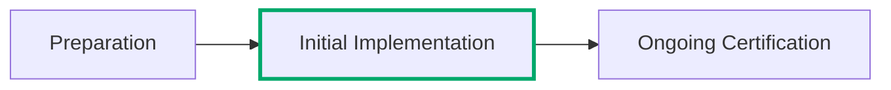

---
tags:
  - Cloud Service Providers
  - Guidance
picto:
  source: person
---

:lucide-person-standing:{ .person title="This content was written by a human just for this page." }

# Getting Listed

The [FedRAMP Marketplace](https://fedramp.gov/marketplace) the authoritative repository that lists all
cloud service offerings have an active FedRAMP Certification and those who are close to doing so. The
Consolidated Rules for 2026 now allow cloud service providers who are early in the implementation phase
for obtaining a FedRAMP Certification to be listed as well.

## FedRAMP Rules for Marketplace Listing

Navigating the initial FedRAMP Marketplace Listing rules is a good tutorial to both the underlying
FedRAMP rules and the changes you'll need to start making to obtain and maintain a FedRAMP Certification.
These rules outline a series of obligations that the cloud service provider will make in order to
be listed in the FedRAMP Marketplace in the Implementation Phase:

1. You will need a website that hosts specific information about your cloud service offering, and you'll
   need to make some of that information available on the site in a special JSON file for FedRAMP.

2. You will need to be able to prove that your cloud service offering is eligible for a FedRAMP Certification

3. You will need a basic FedRAMP-compatible Trust Center.

4. You will commit to providing quarterly updates that demonstrate your progress towards obtaining a
   FedRAMP Certification, measured against your own internal goals

5. You will commit to beginning an assessment to receive a FedRAMP Certification of some kind within
   2 years of your initial listing - in general, with FedRAMP 20x, you should be able to qualify for
   a FedRAMP Class B Certification within a few months so there's no reason to delay.

!!! warning "Providers will need to address all rules when applying for a Marketplace listing!"

    FedRAMP expects providers to work with advisors or other third-parties to ensure they have
    performed all necessary activities prior to submitting a request for a Marketplace listing
    (such as confirming the JSON data is available and valid against the required schema).
    FedRAMP does not supply support to guide cloud service providers through this process, and
    will reject applications that do not meet the requirements with only the minimum amount of
    information necessary to explain the rejection.

    Please be considerate of government resources and help us operate efficiently with our
    limited government funding by ensuring all applications are complete in advance!

!!! tip "Next Steps"

    Follow the [FedRAMP rules for Marketplace Listing here](marketplace-listing.md)!
