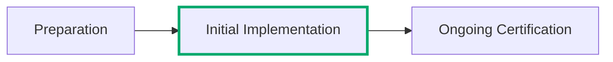

---
tags:
  - Cloud Service Providers
  - Guidance
picto:
  source: person
---

:lucide-person-standing:{ .person title="This content was written by a human just for this page." }

# Addressing Rules

FedRAMP frequently uses plain language to address basic tasks within the Consolidated Rules for 2026. If a term
is not explicitly defined in the FedRAMP Definitions or a FedRAMP rule, then we expect folks to align with
the basic plain language meaning of the term.

!!! tip "It's not a trap!"

    Seriously, FedRAMP is not trying to trick anyone. If it feels like a trap then you are most likely overthinking it.

## How to Address FedRAMP Rules

Any time we say that a cloud service provider or agency must "address" a FedRAMP rule, we mean that you need to demonstrate
you have read the rule, understood it, and implemented whatever is necessary within the context of the Consolidated Rules to
follow the rule and explain how you are following it (or to document a decision not to follow it and your reasoning).

In general, "addressing" a FedRAMP rule will mean reviewing, implementing, verifying, validating, including it in the
Security Decision Record, and following all other applicable rules.

## How to Follow FedRAMP Rules

This is a subset of "addressing" FedRAMP rules - the act of implementing the rule or deciding not to. You "address" it by
explaining how you are "following" it (or not).

## Applicability

Many FedRAMP rules are written to apply in different situations, such as some rules that apply to different classes or
other rules that only apply in specific circumstances. When a rule includes applicability language then you simply need
to apply the context of the situation for you specifically.

!!! example "Example: A rule says to take all applicable actions."

    A nearby rule says all cloud service offerings have to do X and Y, but only Class D Certified cloud services have to also do Z.

    If you are a Class C Certified cloud service then only X and Y apply.

    If you are a Class D Certified cloud service then X, Y, and Z all apply.

## Availability

There are a few FedRAMP rules that request long (or short) lists of information. These typically have a caveat of some type
such as "supply the following available information" or similar. In these cases it means exactly what it says - if you don't
have one of the items that it requests available, then you do not need to supply it (and probably will just say that it's not
available).

!!! example "CDS-CSO-PUB (Public Information) requires the FedRAMP ID"

    Providers must have a public information listing that meets the CDS-CSO-PUB
    requirements in order to request a FedRAMP ID, then to maintain FedRAMP Certification.

    Obviously the FedRAMP ID is not available until after a FedRAMP ID is
    granted, so either placeholder data or "not available" is perfectly
    appropriate to include for the required FedRAMP ID until one is assigned.

