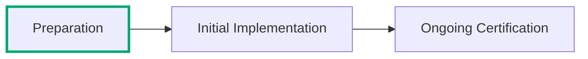
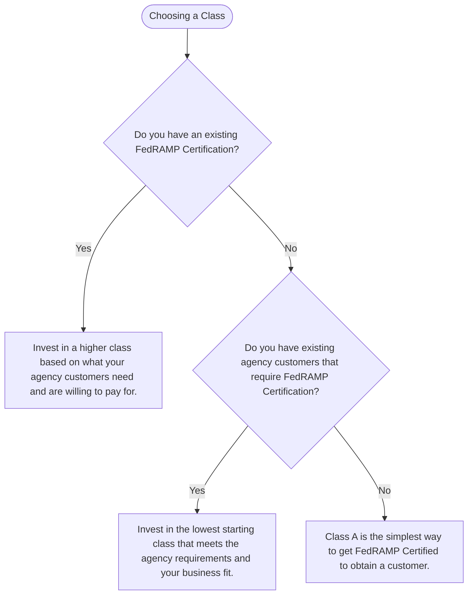

---
tags:
  - Cloud Service Providers
  - Guidance
picto:
  source: person
  status: stable
---

:lucide-person-standing:{ .person title="This content was written by a human just for this page." } :lucide-book-open-check:{ .stable title="This content is relatively stable and only minor changes are expected." }

# Choosing a Certification Class

FedRAMP Classes are designed to be undertaken progressively where your investment can scale with agency interest and resource availability. The further the class progression, the greater the level of assurance and commitment to federal agency customers.

FedRAMP Certification requires additional work and focus, both initially and ongoing, for even the most mature security programs. These unique expectations and considerations are designed to translate
commercial security best practices into requirements that government agencies understand and ensure that consistent ongoing assurance is supplied in the same way so that government customers
can meet their many legal, regulatory, and policy requirements for operating federal information systems securely.

Each FedRAMP Certification Class provides progressively more assurance, commitment, and alignment with diverse agency needs; this requires additional preparation, familiarity with the federal process, and investment at every stage.

| Area of Impact | Class A | Class B | Class C | Class D |
| -- | -- | -- | -- | -- |
| Preparation | :material-star-box-outline:{ .lg .middle .machine } | :material-star-box-outline:{ .lg .middle .person }:material-star-box-outline:{ .lg .middle .person }:material-star-box-outline:{ .lg .middle .person }| :material-star-box-outline:{ .lg .middle }:material-star-box-outline:{ .lg .middle }:material-star-box-outline:{ .lg .middle }:material-star-box-outline:{ .lg .middle } |:material-star-box-outline:{ .lg .middle .empty }:material-star-box-outline:{ .lg .middle .empty}:material-star-box-outline:{ .lg .middle .empty}:material-star-box-outline:{ .lg .middle .empty}:material-star-box-outline:{ .lg .middle .empty}  |
| Federal Process Maturity | :material-star-box-outline:{ .lg .middle .machine }:material-star-box-outline:{ .lg .middle .machine } | :material-star-box-outline:{ .lg .middle  .person}:material-star-box-outline:{ .lg .middle .person } | :material-star-box-outline:{ .lg .middle }:material-star-box-outline:{ .lg .middle }:material-star-box-outline:{ .lg .middle }  | :material-star-box-outline:{ .lg .middle .empty }:material-star-box-outline:{ .lg .middle .empty}:material-star-box-outline:{ .lg .middle .empty}:material-star-box-outline:{ .lg .middle .empty}:material-star-box-outline:{ .lg .middle .empty} |
| Automation | :material-star-box-outline:{ .lg .middle .machine } | :material-star-box-outline:{ .lg .middle .person } | :material-star-box-outline:{ .lg .middle }:material-star-box-outline:{ .lg .middle }:material-star-box-outline:{ .lg .middle } | :material-star-box-outline:{ .lg .middle .empty }:material-star-box-outline:{ .lg .middle .empty}:material-star-box-outline:{ .lg .middle .empty}:material-star-box-outline:{ .lg .middle .empty}:material-star-box-outline:{ .lg .middle .empty}  |
| Verification and Validation | :material-star-box-outline:{ .lg .middle .machine } | :material-star-box-outline:{ .lg .middle .person }:material-star-box-outline:{ .lg .middle .person } | :material-star-box-outline:{ .lg .middle }:material-star-box-outline:{ .lg .middle }:material-star-box-outline:{ .lg .middle }  |:material-star-box-outline:{ .lg .middle .empty }:material-star-box-outline:{ .lg .middle .empty}:material-star-box-outline:{ .lg .middle .empty}:material-star-box-outline:{ .lg .middle .empty}:material-star-box-outline:{ .lg .middle .empty}  |
| Agency Assurance | :material-star-box-outline:{ .lg .middle .machine } |:material-star-box-outline:{ .lg .middle .person }:material-star-box-outline:{ .lg .middle .person } |:material-star-box-outline:{ .lg .middle }:material-star-box-outline:{ .lg .middle }:material-star-box-outline:{ .lg .middle } |:material-star-box-outline:{ .lg .middle .empty }:material-star-box-outline:{ .lg .middle .empty}:material-star-box-outline:{ .lg .middle .empty}:material-star-box-outline:{ .lg .middle .empty}:material-star-box-outline:{ .lg .middle .empty} |
| Cost | :lucide-circle-dollar-sign:{ .lg .middle .machine } | :lucide-circle-dollar-sign:{ .lg .middle .person }:lucide-circle-dollar-sign:{ .lg .middle .person } | :lucide-circle-dollar-sign:{ .lg .middle }:lucide-circle-dollar-sign:{ .lg .middle }:lucide-circle-dollar-sign:{ .lg .middle } | :lucide-circle-dollar-sign:{ .lg .middle .empty }:lucide-circle-dollar-sign:{ .lg .middle .empty }:lucide-circle-dollar-sign:{ .lg .middle .empty }:lucide-circle-dollar-sign:{ .lg .middle .empty }:lucide-circle-dollar-sign:{ .lg .middle .empty} |

!!! tip "Start with FedRAMP Class A Certification"

    In most situations, cloud service providers that are looking to enter the federal market should start with a FedRAMP Class A Certification, which
    is designed for existing commercial products that already have a SOC 2 Type II certification and a mature security program.

!!! warning "Be careful starting with FedRAMP Class C or Class D Certification!"

    Cloud service providers generally should not go straight to FedRAMP Class C or Class D Certification unless they have an existing
    contract with a government agency that requires this level of commitment. These Certification Classes are intended for providers
    with an active customer base who have already invested in a federal compliance program.

## Decision Workflow

## What about Low, Moderate, and High?

Federal agencies categorize their information systems following the [NIST Federal Information Processing Standards
for Security Categorization of Federal Information and Information Systems](https://csrc.nist.gov/pubs/fips/199/final) (FIPS Publication 199).
FIPS 199 defines security categories of low impact, moderate impact, and high impact, based on the potential impact to the agency from a loss of confidentiality,
integrity, or available of the information in the system. [NIST Federal Information Processing Standards for Minimum
Security Requirements for Federal Information and Information Systems](https://csrc.nist.gov/pubs/fips/200/final) (FIPS Publication 200)
requires federal agencies to set the overall impact level of a system at the highest security categorization of the
three security objectives, then employ appropriately tailored controls.

FedRAMP Certification Classes loosely align with the baseline security expectations for these impact levels as outlined in [NIST SP 800-53B Control Baselines
for Information Systems and Organizations](https://csrc.nist.gov/pubs/sp/800/53/b/upd1/final). There is not a direct
correlation between FedRAMP Certification Class and Impact Level for the following key reasons:

1. Cloud service providers may tailor controls within the baseline to increase or reduce their focus on different security objectives; not all baselines are implemented the same.

2. Agencies may include services with lower or higher security categorizations inside their federal information system by tailoring the control baseline, establishing compensating controls, or controlling information flow within the system to ensure components operate safely with different security categorizations than the overall system.

!!! warning "Commercial cloud services are not usually federal information systems!"

    Cloud services used by federal agencies are usually a component within a federal information system, but the cloud service
    itself is not subject to laws, regulations, or policies for federal information systems unless it is built by the
    government or under explicit contract where the provider operates the service on behalf of the government.

    In most cases, commercial cloud services are simply a service that is used by a federal information system and should
    not be considered an information system operated on behalf of the government.

### Alignment with Agency Use Cases

In general, the FedRAMP Certification Classes are designed to provide the minimum assurance necessary for an
authorizing official to make a determination to include the service in a federal information system at a
specific impact level, as follows:

| FedRAMP Certification Class | Agency Usage |
| -- | -- |
| Class A | Class A Certifications include adequate information for most non-sensitive use cases and some Low, Moderate, or High security objectives. |
| Class B | Class B Certifications include adequate information for most Low security objectives and some Moderate or High security objectives. |
| Class C | Class C Certifications include adequate information for most Low and Moderate security objectives, as well as some High security objectives. |
| Class D | Class D Certifications include adequate information for most use cases regardless of security objective (this does not include systems that process classified information).|
