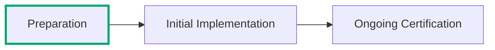

:lucide-person-standing:{ .person title="This content was written by a human just for this page." } :lucide-book-open-check:{ .stable title="This content is relatively stable and only minor changes are expected." }

??? info inline end "Page Info"

    **Description:** How to get started in these consolidated rules and on your FedRAMP journey because it's a whole thing mate. Maybe some diagrams?
    
    **Purpose:** Providers will learn to navigate through a lot of this, including the steps and whatnot.

# Getting Started - The Preparation Phase

Getting started with FedRAMP is intimidating. These Consolidated Rules for 2026 are designed to help folks navigate
the government's expectations for cloud services and understand exactly how FedRAMP works... but it's a lot. The
simple fact is that FedRAMP is one of many complex aspects of making a service available to the federal government
that requires subject matter expertise and a serious time commitment.

## Step by Step Preparation

This section of the site is laid out in the order that new cloud service providers should approach obtaining
a FedRAMP Certification. Here is a general overall of the recommended approach:

| Step | What to do                                                            | Learn more                               |
| ---- | --------------------------------------------------------------------- | ---------------------------------------- |
| **1**    | Working with the government isn't like doing commercial business and FedRAMP is just one small part of it - you'll probably need an advisory service to help you navigate. | [Finding an Advisor](advisor/){ data-preview }           |
| **2**    | [FedRAMP Certification](../../certification.md){ data-preview } comes in many shapes and sizes for different purposes and use cases, so you'll need to target a specific initial and ongoing FedRAMP Certification Profile based on your individual company's circumstances.  Your choice of path depends on how you got here - if you already have an Agency Sponsor that is prepared to give you a FedRAMP Rev5 Agency Certification, then your path is already set. Alternatively, FedRAMP itself can be your sponsor for FedRAMP 20x. | [Choosing a Certification Path](path/){ data-preview }    |
| **3**    | The simplest option is to start with a Class A Certification while planning to upgrade later, but some providers might have a contract for a specific FedRAMP Certification Class they'll need to shoot for. Think carefully about readiness, customer needs, and how the class affects assessment expectations before aiming too high too early - never plan to go straight to Class D. | [Choosing a Certification Class](class/){ data-preview } |
| **4**    | If you're built on the cloud already and can easily deploy to FedRAMP Certified infrastructure or platforms, then you'll want to target a cloud-native FedRAMP 20x Certification. If you run your own infrastructure then you'll need to stick with a modernized FedRAMP Rev5 Certification. | [Choosing a Certification Type](type/){ data-preview }    |
| **5**    | Once you know your target FedRAMP Certification Profile, enter the Implementation Phase and start doing the work needed to be ready for assessment and review. This is where your team should confirm scope, address gaps, prepare evidence, and make sure the service is genuinely ready. You'll want to start applying FedRAMP Rules to qualify for a listing on the FedRAMP Marketplace as soon as possible. | [Initial Implementation](../implement/index.md){ data-preview }                     |
