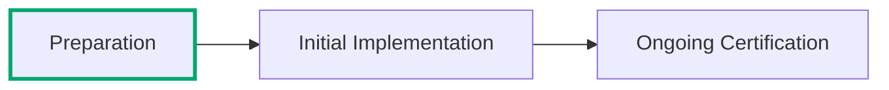

---
tags:
  - Cloud Service Providers
  - Guidance
picto:
  source: person
  status: stable
---

:lucide-person-standing:{ .person title="This content was written by a human just for this page." } :lucide-book-open-check:{ .stable title="This content is relatively stable and only minor changes are expected." }

# Choosing a Certification Path

There are two FedRAMP Certification Paths:

- **Program Certification** is provided directly by FedRAMP and does not require a federal agency to "sponsor" the service for FedRAMP Certification; this path is mostly only available for the 20x Certification Type.
- **Agency Certification** requires a federal agency to authorize the service in advance, following the legacy FedRAMP process, then "sponsor" the service for FedRAMP Certification; this path is only available for the Rev5 Certification Type.

## Choice is a Misnomer

You don't really get to choose your Certification Path because it's the result of the choices you've already made.

- If you intend to obtain a FedRAMP 20x Certification, then you will automatically proceed on the Program Certification Path.
- If you already have an agency sponsor for FedRAMP Rev5, then you will likely proceed on the Agency Certification Path.
- In very limited circumstances, the Program Certification Path is open FedRAMP Rev5 based on specific criteria.

!!! tip "You may obtain a FedRAMP 20x Class A Certification then change it to FedRAMP Rev5 Class B, C, or D via Agency Certification."

### FedRAMP 20x Profiles

| Type | Class | Program Certification Path | Agency Certification Path|
| -- | -- | -- | -- |
| **20x** | Class A | :lucide-badge-check:{ .xl .middle .stable } Required | :lucide-circle-slash:{ .xl .middle .empty } Unavailable|
| **20x** | Class B |  :lucide-badge-check:{ .xl .middle .stable } Required | :lucide-circle-slash:{ .xl .middle .empty } Unavailable|
| **20x** | Class C |  :lucide-badge-check:{ .xl .middle .stable } Required | :lucide-circle-slash:{ .xl .middle .empty } Unavailable|
| **20x** | Class D |  :lucide-wrench:{ .xl .middle .placeholder } Coming In 2027 | :lucide-circle-slash:{ .xl .middle .empty } Unavailable|

### FedRAMP Rev5 (Legacy) Profiles

| Type | Class | Program Certification Path | Agency Certification Path|
| -- | -- | -- | -- |
| _Rev5_ | Class A | :lucide-circle-slash:{ .xl .middle .empty } Unavailable | :lucide-circle-slash:{ .xl .middle .empty } Unavailable|
| _Rev5_ | Class B | :lucide-circle-dashed:{ .xl .middle .placeholder } Limited| :lucide-badge-check:{ .xl .middle .stable } Generally Required|
| _Rev5_ | Class C | :lucide-circle-dashed:{ .xl .middle .placeholder } Limited| :lucide-badge-check:{ .xl .middle .stable } Generally Required|
| _Rev5_ | Class D | :lucide-circle-slash:{ .xl .middle .empty } Unavailable | :lucide-badge-check:{ .xl .middle .stable } Required|

## Temporary Rev5 Program Certification Availability For Class B and C

Two extremely limited Rev5 Program Certification pipelines will open in 2026. These pipelines
will close on June 11, 2027, when FedRAMP stops accepting FedRAMP Rev5 Certification applications.

!!! danger "Program Certifications are limited to one type, either 20x or Rev5."

    FedRAMP will not provide Program Certifications for both 20x and Rev5! Providers must pick one.

!!! warning "The effective dates for those seeking to obtain a FedRAMP Certification will still apply!"

    On January 1, 2027, all Consolidated Rules for 2026 requirements become mandatory for any
    cloud service provider seeking to obtain a FedRAMP Certification. These requirements will apply
    on that date to any **Ready Conversation** or **Lost Sponsor** applicant that did not apply
    prior to that date.

### Ready Conversion

The **Ready Conversion** application pipeline is open to cloud service providers that were
FedRAMP Ready prior to July 28, 2026.

- **Opens:** August 10, 2026
- **CR26 Grace Period Ends:** February 19, 2027
- Available for **Class B** or **Class C**

Applicants may submit an fresh version of their legacy FedRAMP Ready submission to qualify for
a Class B or Class C Certification (pilot) with an agreement to follow all updated rules for FedRAMP
Rev5 by February 19, 2027.

!!! info "FedRAMP must confirm eligibility prior to submission."

    To confirm eligibility, follow the instructions at [help.fedramp.gov/ready-conversion](https://help.fedramp.gov).
    **Note: This URL and landing page does not exist yet!**

### Lost Sponsor

The **Lost Sponsor** application pipeline is intended for cloud service providers that had
begun the legacy FedRAMP authorization process with an agency sponsor but were unable to complete
the process for reasons that were out of their control (typically because the agency canceled
the sponsorship due to budget cuts).

- **Opens:** August 10, 2026
- **CR26 Grace Period Ends:** February 19, 2027
- Available for **Class B** or **Class C**

To qualify for this pipeline, a cloud service provider must have met **one** of the following
criteria between January 2025 and March 2026:

- Was In Process on the FedRAMP Marketplace but lost sponsorship.
- Completed a full FedRAMP assessment with a Security Assessment Plan and Security Assessment
  Report (SAP/SAR) under an informal agreement with an agency to initiate In Process once it
  was complete.

Applicants may submit a fresh version of their legacy FedRAMP Rev5 materials, including a
completed assessment (if it was not completed), to qualify for a Class B or Class C Certification
(pilot) with an agreement to follow all updated rules for FedRAMP Rev5 by February 19, 2027.

!!! info "FedRAMP must confirm eligibility prior to submission."

    To confirm eligibility, follow the instructions at [help.fedramp.gov/lost-sponsor](https://help.fedramp.gov).
    **Note: This URL and landing page does not exist yet!**

